# Scene-text VQA 정적 EDA: train/test 분포 비교

생성 시각: 2026-09-21 15:09:19 KST  
대상: train 6,714개, test 6,714개. 추가로 dev 2,683개 이미지의 무결성과 이미지 지표도 전수 계산했다.

## 핵심 요약

- CSV와 이미지 대응: 세 split 모두 누락/초과 파일 0개, 읽기 실패 0개.
- 가장 큰 연속형 분포 차이: red_std (SMD +0.048), contrast (SMD +0.037), green_std (SMD +0.033), green_mean (SMD -0.032), brightness (SMD -0.030). 일반적으로 |SMD| 0.2 미만은 작은 차이로 해석한다.
- 방향 범주의 train/test 총변동거리(TV): **0.0043**, 질문 유형 TV: **0.0152** (0은 동일, 1은 완전 분리).
- 임베딩: centroid cosine **0.999897**, PCA-64 Fréchet **0.0010**, RBF MMD² **0.000762**.
- 완전 동일 파일 그룹 45개(그중 train-test 교차 그룹 24개). 여기에 SHA는 다르지만 pHash 유사 후보 train-test 교차 6쌍이 추가로 있다. 이는 split 간 이미지 재사용이 실제로 존재함을 뜻한다.

## 1. 이미지 크기 / 종횡비

| 방향 | train | train % | test | test % |
|---|---|---|---|---|
| landscape | 1685 | 25.10 | 1656 | 24.66 |
| portrait | 4819 | 71.78 | 4820 | 71.79 |
| square | 210 | 3.13 | 238 | 3.54 |

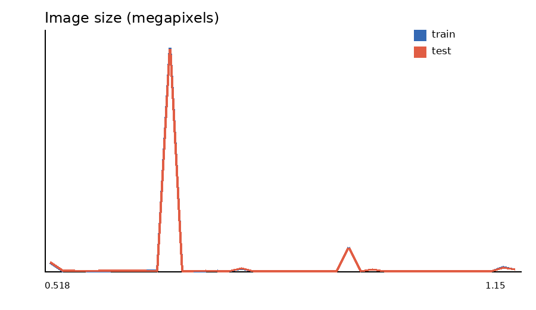
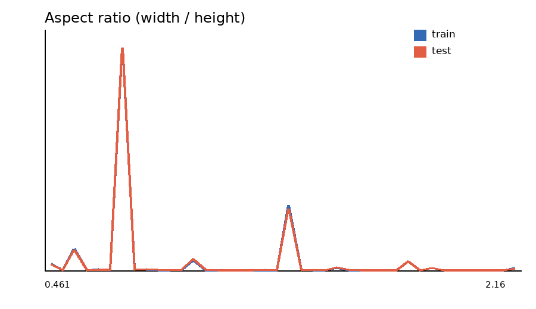

## 2. 밝기 / 대비 / 색상 분포

픽셀 기반 지표는 각 원본의 종횡비를 보존한 최대 256×256 축소본 전체 픽셀에서 계산했다. 값 범위는 RGB/gray 모두 0~1이다.

| 지표 | train 평균 | test 평균 | train 중앙값 | test 중앙값 | SMD | KS |
|---|---|---|---|---|---|---|
| width | 800.2668 | 798.7946 | 720.0000 | 720.0000 | -0.0089 | 0.0070 |
| height | 923.1527 | 921.3324 | 960.0000 | 960.0000 | -0.0108 | 0.0055 |
| megapixels | 0.7225 | 0.7201 | 0.6912 | 0.6912 | -0.0214 | 0.0082 |
| aspect_ratio | 0.9154 | 0.9145 | 0.7500 | 0.7500 | -0.0029 | 0.0070 |
| jpeg_bytes_per_pixel | 0.1543 | 0.1545 | 0.1509 | 0.1511 | 0.0023 | 0.0095 |
| brightness | 0.4750 | 0.4721 | 0.4811 | 0.4767 | -0.0303 | 0.0235 |
| contrast | 0.2161 | 0.2177 | 0.2168 | 0.2191 | 0.0373 | 0.0308 |
| saturation | 0.2287 | 0.2285 | 0.2112 | 0.2113 | -0.0020 | 0.0133 |
| colorfulness | 0.1435 | 0.1432 | 0.1321 | 0.1317 | -0.0036 | 0.0100 |
| entropy_bits | 7.3818 | 7.3891 | 7.4889 | 7.4905 | 0.0176 | 0.0137 |
| edge_density | 0.1302 | 0.1307 | 0.1228 | 0.1233 | 0.0079 | 0.0085 |
| laplacian_variance | 0.0391 | 0.0394 | 0.0355 | 0.0357 | 0.0122 | 0.0092 |

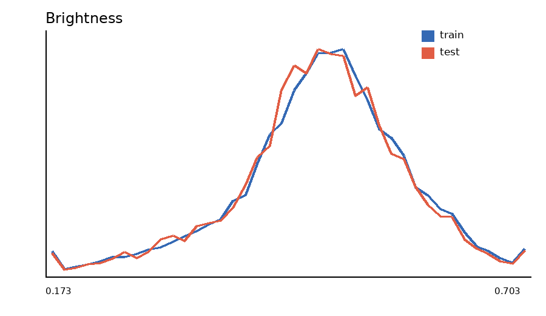
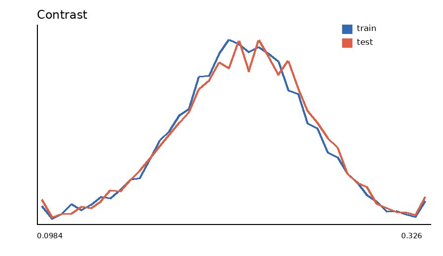
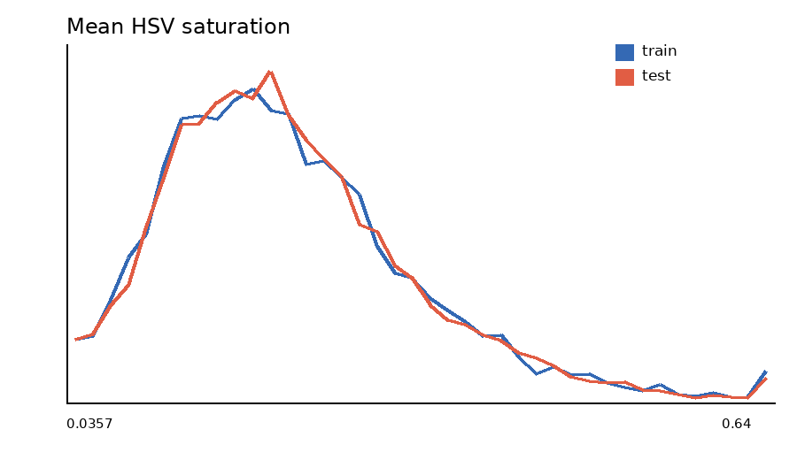
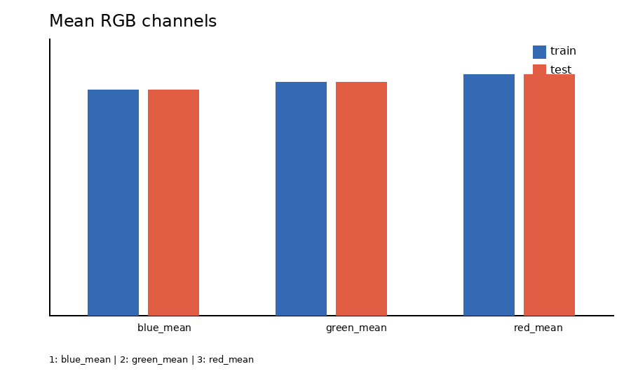

## 3. 이미지 복잡도 / 정보량

- `entropy_bits`: 8-bit grayscale Shannon entropy(최대 8 bit).
- `edge_density`: 인접 픽셀 gradient가 0.10을 넘는 비율.
- `laplacian_variance`: 초점/고주파 정보의 대리 지표(축소 gray, 정규화 단위).
- `jpeg_bytes_per_pixel`: 압축 파일 크기/원본 픽셀 수. 콘텐츠뿐 아니라 JPEG 품질에도 영향을 받는다.

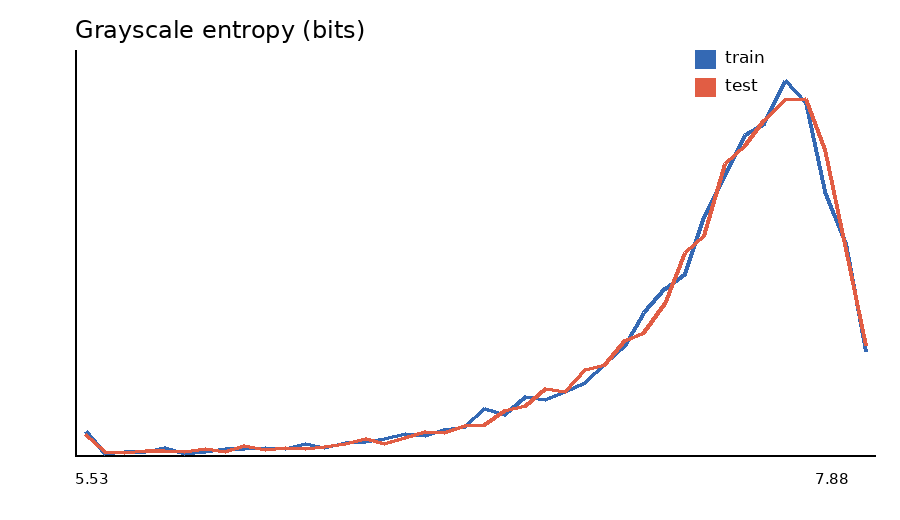
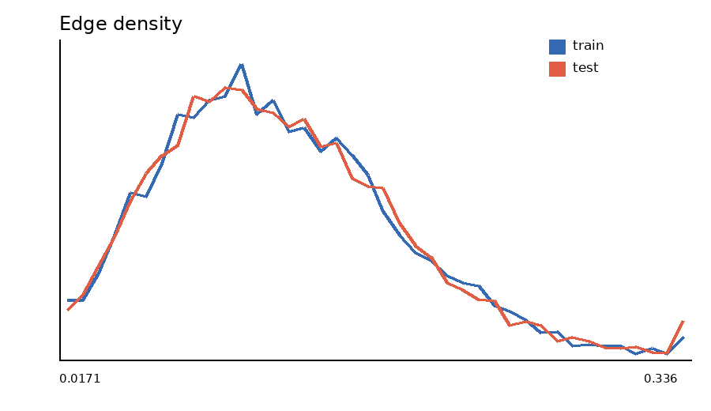

## 4. 질문 길이 / 선택지 길이

`chars`는 Python 문자열 길이, `tokens_ws`는 공백 기준 어절 수다. 모델 tokenizer 토큰 수가 아님에 유의한다.

| 지표 | train 평균 | test 평균 | train 중앙값 | test 중앙값 | SMD | KS |
|---|---|---|---|---|---|---|
| question_chars | 31.831 | 31.740 | 30.000 | 30.000 | -0.009 | 0.015 |
| question_tokens_ws | 7.874 | 7.851 | 8.000 | 8.000 | -0.009 | 0.008 |
| choice_chars_mean | 8.879 | 8.845 | 7.000 | 7.000 | -0.006 | 0.015 |
| choice_chars_max | 10.989 | 10.948 | 9.000 | 9.000 | -0.005 | 0.013 |
| choice_chars_total | 35.517 | 35.379 | 28.000 | 28.000 | -0.006 | 0.015 |

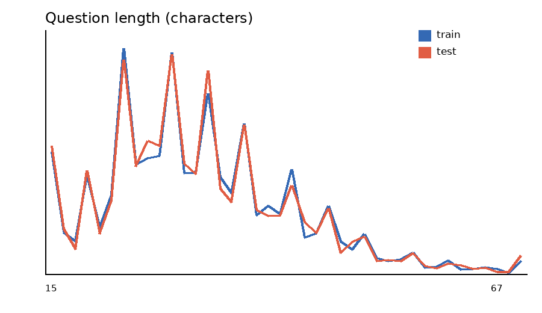
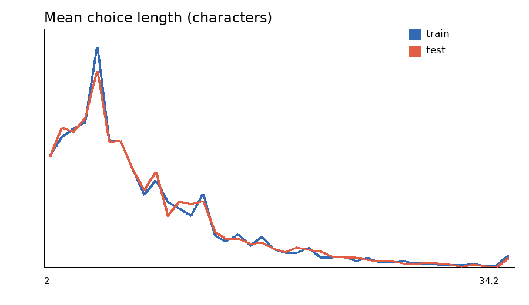

## 5. 정답 분포

| 정답 | 개수 | 비율 % |
|---|---|---|
| a | 1700 | 25.32 |
| b | 1644 | 24.49 |
| c | 1716 | 25.56 |
| d | 1654 | 24.64 |

최대/최소 정답 빈도비는 **1.044**이다. test에는 정답 컬럼이 없으므로 train/test 정답 분포 비교는 불가능하다.

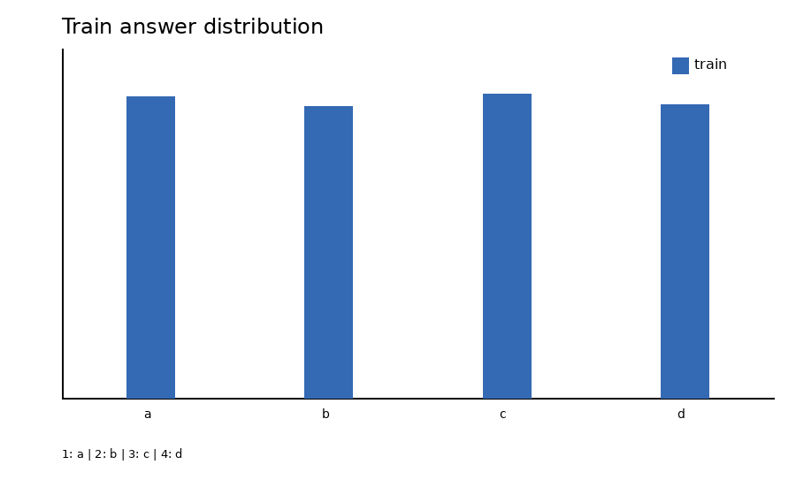

## 6. 질문 유형 분포

질문 유형은 `run_eda.py`의 우선순위 정규식 규칙으로 각 질문에 하나만 부여했다. 따라서 의미론적 정답 라벨이 아니라 재현 가능한 휴리스틱 분석이다.

| 유형 | train | train % | test | test % |
|---|---|---|---|---|
| 문자·간판 읽기 | 2334 | 34.76 | 2318 | 34.52 |
| 기타 | 1085 | 16.16 | 1117 | 16.64 |
| 가격·금액 | 929 | 13.84 | 902 | 13.43 |
| 위치·방향 | 613 | 9.13 | 633 | 9.43 |
| 메뉴·상품 | 608 | 9.06 | 612 | 9.12 |
| 날짜·시간 | 341 | 5.08 | 333 | 4.96 |
| 전화번호 | 336 | 5.00 | 296 | 4.41 |
| 색상 | 301 | 4.48 | 331 | 4.93 |
| 인물·대상 | 89 | 1.33 | 105 | 1.56 |
| 수량·계수 | 78 | 1.16 | 67 | 1.00 |

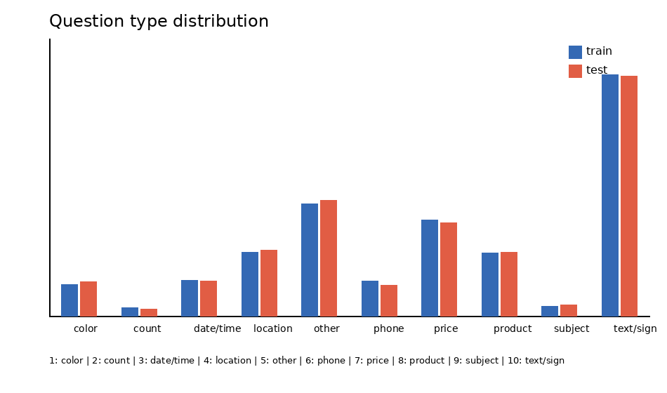

## 7. Train/Test 이미지 임베딩 분포

모델: `torchvision ResNet-18 ImageNet-1K V1, global-average-pooled 512D L2-normalized features`. PCA는 split별 최대 3,000개로 공동 fit하고, 모든 13,428개 이미지를 투영했다. MMD는 split별 1000개 고정 seed 표본, Fréchet은 PCA 64차원에서 계산했다.

- PCA 64축 설명분산: **0.7006**
- 첫 2축 설명분산: **0.1572**
- PCA-64 centroid 거리: **0.0095**
- 원본 512차원 centroid cosine 유사도: **0.999897**
- PCA-64 Fréchet 거리: **0.0010**
- PCA-64 RBF MMD²: **0.000762**

| component | explained_variance_ratio | train_mean | test_mean | train_std | test_std | ks_statistic |
|---|---|---|---|---|---|---|
| 1 | 0.11315 | -0.00462 | -0.00226 | 0.20487 | 0.20690 | 0.01057 |
| 2 | 0.04406 | 0.00285 | -0.00140 | 0.12957 | 0.12854 | 0.02160 |
| 3 | 0.04153 | -0.00133 | -0.00153 | 0.12461 | 0.12553 | 0.01623 |
| 4 | 0.03200 | 0.00073 | 0.00009 | 0.10913 | 0.11070 | 0.01236 |
| 5 | 0.02638 | -0.00198 | -0.00148 | 0.09787 | 0.10006 | 0.01162 |

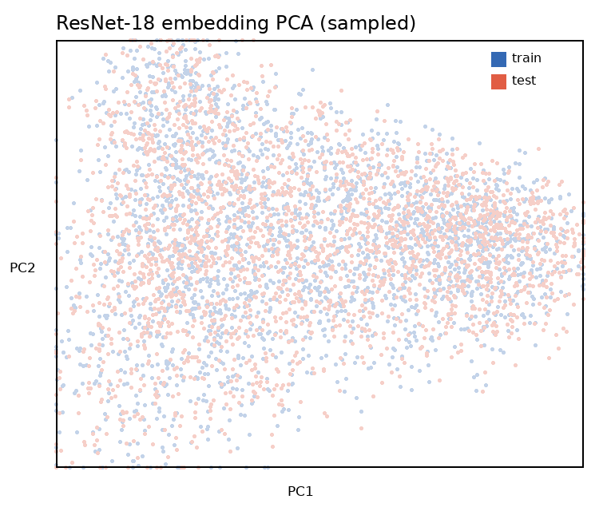

이 거리들은 동일 모델/전처리로 다른 split 조합과 비교할 때 의미가 크며, 절대값만으로 데이터 누수를 단정해서는 안 된다.

## 8. 중복 이미지 / 유사 이미지

- 완전 중복은 파일 바이트 SHA-256 동일 여부로 판정했다: 전체 45그룹, train 내부 7그룹, test 내부 7그룹, train-test 교차 **24그룹**이다. 상세: [exact_duplicates.csv](tables/exact_duplicates.csv).
- 교차 완전 중복의 질문까지 결합한 표는 [exact_cross_split_pairs.csv](tables/exact_cross_split_pairs.csv)다. 교차 24쌍 중 질문 문자열까지 완전히 같은 것은 1쌍이며, 나머지는 같은 이미지에 다른 질문 또는 표현을 사용한다.
- 유사 후보는 32×32 DCT pHash 64-bit의 해밍거리 ≤ 6이면서 SHA-256은 다른 쌍이다: [similar_image_candidates.csv](tables/similar_image_candidates.csv). 같은 크기인 경우 원본 RGB의 `pixel_mae`와 99백분위 절대 오차도 기록했다.
- 유사 후보 CSV는 거리 오름차순 최대 1,000쌍이다. OCR 문서형 데이터에서는 레이아웃이 비슷한 오탐이 있으므로 누수 판정 전 원본을 육안 확인해야 한다. 다만 교차 후보 6쌍은 모두 pHash 거리 0이고 픽셀 MAE도 낮아, 재인코딩된 동일 장면일 가능성이 매우 높다.
- 따라서 향후 자체 검증 split은 반드시 이미지 해시/pHash 그룹 단위로 나누어야 한다. 고정 test에는 train 이미지와 같은 장면이 포함되어 있으므로 이미지 검색 기반 누수 가능성도 별도로 관리해야 한다.

## 해석 기준과 한계

- SMD는 `(test 평균 - train 평균) / pooled 표준편차`; 부호는 test가 더 큰지 나타낸다. KS는 최대 누적분포 차이(0~1)다.
- TV는 범주 비율 차이의 절반 합(0~1)이다.
- p-value는 표본 수에 매우 민감하므로 의도적으로 보고하지 않고 효과크기와 분포 거리를 보고했다.
- ResNet-18은 일반 자연 이미지 사전학습 모델이라 OCR 텍스트의 철자/내용 유사성을 직접 보장하지 않는다.
- dev의 `answer1`~`answer5`는 복수 annotator 응답이므로 train의 단일 `answer`와 같은 표에 섞지 않았다.

## 산출물

- `tables/image_metrics.csv`: 16,111개 전 이미지 지표와 해시
- `tables/text_metrics.csv`: train/test 질문·선택지 지표와 질문 유형
- `tables/numeric_summary.csv`, `tables/train_test_numeric_comparison.csv`
- `tables/embedding_pc_comparison.csv`, `embedding_pca_projection.npz`
- `summary.json`: 주요 수치의 machine-readable 요약
- `plots/`: 비교 시각화

## 재실행

```bash
# repo root에서
TORCH_HOME=eda/.cache/torch uv run python eda/run_eda.py --resume
```

최초 실행은 torchvision의 ResNet-18 가중치(약 45MB)를 내려받는다. 이후 `eda/.cache`를 재사용한다.
